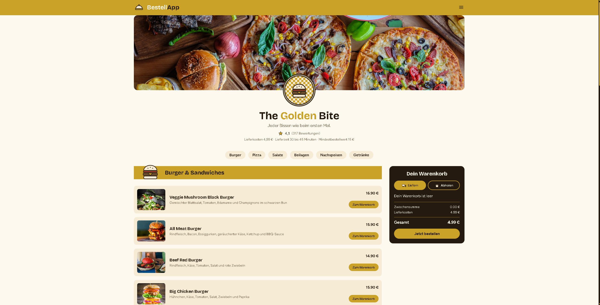

# Bestell-App

A Lieferando clone built as the final project of Module 7 at [Developer Akademie](https://developerakademie.com). Menu with categories, shopping basket with quantity controls, live total calculation, and a complete checkout flow, built with plain HTML, CSS, and JavaScript, no frameworks or build tools.



## Features

### Menu

- Dishes rendered dynamically from a data object, split into categories (Burgers, Pizza, Salads, Sides, Desserts, Drinks)
- Jump-link navigation to each category

### Basket

- Add dishes with a click, adjust quantity via plus/minus
- Remove individual entries, automatic removal when quantity is 1 and minus is clicked
- Subtotal, delivery fee, and total calculated live
- Delivery/pickup toggle, delivery fee is waived on pickup
- Persisted via `localStorage`, the basket survives a page reload
- Desktop: basket sticky on the side. Mobile: bottom bar, opens as a fullscreen dialog

### Checkout

- Order confirmation without `alert()`, basket is cleared automatically afterward

### Other

- Fully responsive, tested from 310px to 1920px width
- Imprint and cookie settings as separate subpages

## Tech Stack

- HTML5, CSS3 (Flexbox, Grid, Custom Properties)
- Vanilla JavaScript (no framework, no libraries)

## Project Structure

```
├── index.html
├── style.css
├── script.js
├── html/
│   ├── impressum.html
│   └── cookies.html
├── script/
│   ├── data.js           # Menu as a data object
│   └── template.js       # HTML template functions
├── style/
│   ├── standard.css       # Reset & basics
│   ├── basket.css         # Basket styling
│   └── fonts.css
└── assets/
    ├── icons/
    ├── img/
    └── fonts/
```

## Running Locally

No build process needed, a local server is enough (needed for image/script paths):

```bash
python -m http.server 8000
```

Then open `index.html` in the browser.

## Checklist Requirements

- Maximum 14 lines per function
- camelCase, meaningful names
- HTML templates extracted into their own functions
- Responsive down to 320px with no horizontal scrollbar
- Content capped at 1440px

## Author

All code in this project was written by me, Fabian Klemenz, as part of my training at Developer Akademie.
